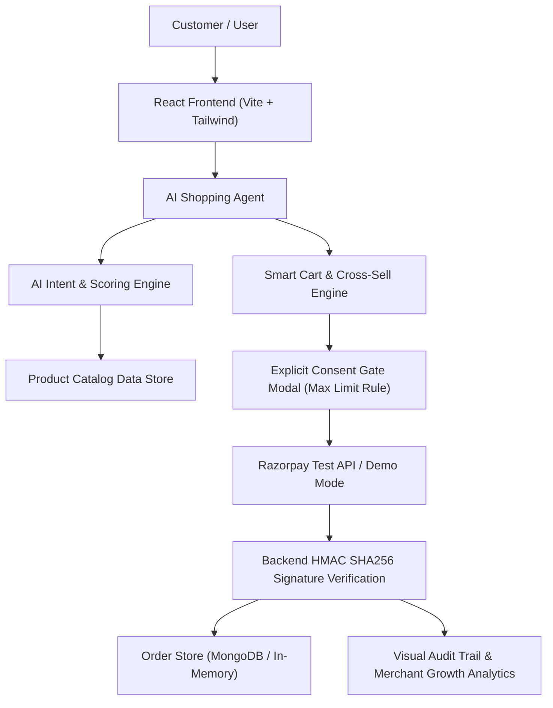

# ShopPilot AI 🚀
> **“Turn customer intent into intelligent purchases.”**

[](https://razorpay.com)
[](LICENSE)
[](#)

---

## 📌 Executive Summary & Vision

**ShopPilot AI** is an AI-native shopping and merchant-growth agent built for **Track 1: AI Growth & Agentic Commerce** of the Razorpay AI Builder Internship 2026. 

Traditional e-commerce forces users through tedious rigid category filters and keyword searches, while standard chatbots only answer text without taking transaction action. **ShopPilot AI** bridges this gap by acting as an autonomous commerce agent that:
1. **Understands complex natural-language customer intent** (e.g. *"I need a laptop for coding under ₹60,000"*).
2. **Scores catalog inventory** and recommends the best product with transparent *"Why this product?"* reasoning.
3. **Drives Merchant Revenue Growth** through smart, non-coercive cross-sell/upsell add-ons with real-time basket math.
4. **Safely Executes Transactions** using an explicit **Payment Consent Gate**, transaction limits (`MAX_AI_ORDER_VALUE = ₹1,00,000`), and backend-verified **Razorpay Test Mode** payments.
5. **Maintains Complete Accountability** with a full visual **Audit Trail** and **Merchant Growth Analytics Dashboard**.

---

## 🏗️ System Architecture



---

## ✨ Key Features

| Feature | Description |
| :--- | :--- |
| **🧠 Agentic Product Discovery** | Extracts budget, category, specs, and user role (coding, study, gaming) from raw text prompts. |
| **💡 Transparency Engine** | Provides expandable *"Why this product?"* justification bullet points matching specs & rating. |
| **📈 Smart Upsell / Cross-Sell** | Automatically pairs complementary items (e.g. mouse + stand for laptops) to boost merchant Average Order Value (AOV). |
| **🔐 Bounded Payment Safety** | Prevents autonomous unauthorized spending with an explicit **Consent Gate Modal** & **₹1,00,000 limit guardrail**. |
| **💳 Dual Payment Gateway** | Integrates **Razorpay Test Mode** with backend HMAC SHA256 signature verification + built-in **Demo Payment Mode**. |
| **🛡️ Graceful Failure Recovery** | Handles payment declines (`PAYMENT_FAILED`) cleanly without crashing the UI, allowing instant retries. |
| **📊 Merchant Growth Analytics** | Recharts visual graphs for Revenue Growth, AI-Influenced Sales, Cross-Sell Lift, and Conversion Funnel. |
| **📜 Visual Audit Trail** | Chronological timeline tracking every event: `USER_INTENT` → `PRODUCT_SEARCH` → `RECOMMENDATION` → `UPSELL_SUGGESTED` → `USER_CONFIRMATION` → `PAYMENT_SUCCESS`. |

---

## ⚙️ Tech Stack

### Frontend
- **Framework**: React 18 + Vite
- **Styling**: Tailwind CSS (Bright modern SaaS theme with soft shadows & gradients)
- **Icons**: Lucide React
- **Data Visualization**: Recharts
- **Animations & Effects**: Canvas-Confetti, Tailwind transitions

### Backend
- **Server**: Node.js + Express REST API
- **AI Integration**: `@google/genai` (Gemini API integration) + Fallback Deterministic Scoring Engine
- **Payments**: Razorpay Node SDK + Node `crypto` HMAC SHA256 verification
- **Database**: MongoDB Mongoose support + Zero-config In-Memory Store fallback

---

## 🚀 Quick Start & Installation

### Prerequisites
- **Node.js**: v18.0.0 or higher
- **npm**: v9.0.0 or higher

### 1. Clone & Set Up Environment

```bash
# Clone repository
git clone https://github.com/your-username/shoppilot-ai.git
cd shoppilot-ai

# Copy environment template
cp .env.example .env
```

### 2. Environment Variables (`.env`)

```env
PORT=5000
GEMINI_API_KEY=your_gemini_api_key_optional
RAZORPAY_KEY_ID=your_razorpay_key_id_optional
RAZORPAY_KEY_SECRET=your_razorpay_key_secret_optional
MONGODB_URI=your_mongodb_uri_optional
VITE_API_URL=http://localhost:5000
```
> **Note**: *ShopPilot AI is engineered to work 100% out-of-the-box even without API keys using built-in fallback engines and Demo Payment Mode!*

### 3. Install Dependencies & Run

#### Backend:
```bash
cd backend
npm install
npm run start
```
*Backend runs on `http://localhost:5000`*

#### Frontend:
```bash
cd frontend
npm install
npm run dev
```
*Frontend runs on `http://localhost:3000`*

---

## 🔒 Security & Safety Controls

1. **Backend Razorpay Secret Isolation**: `RAZORPAY_KEY_SECRET` is strictly kept on the Node.js backend.
2. **Signature Verification**: Razorpay payment responses are verified via HMAC SHA256 signature algorithm (`order_id + "|" + payment_id`).
3. **Transaction Limit**: Automated AI orders are bounded to `MAX_AI_ORDER_VALUE = ₹1,00,000`. Over-limit carts trigger explicit security alerts.
4. **Audit Logging**: Every agent step and transaction state change is immutably logged with timestamp, event type, and status.

---

## 📜 License

Distributed under the MIT License. Built with ❤️ for the Razorpay AI Builder Internship 2026.
